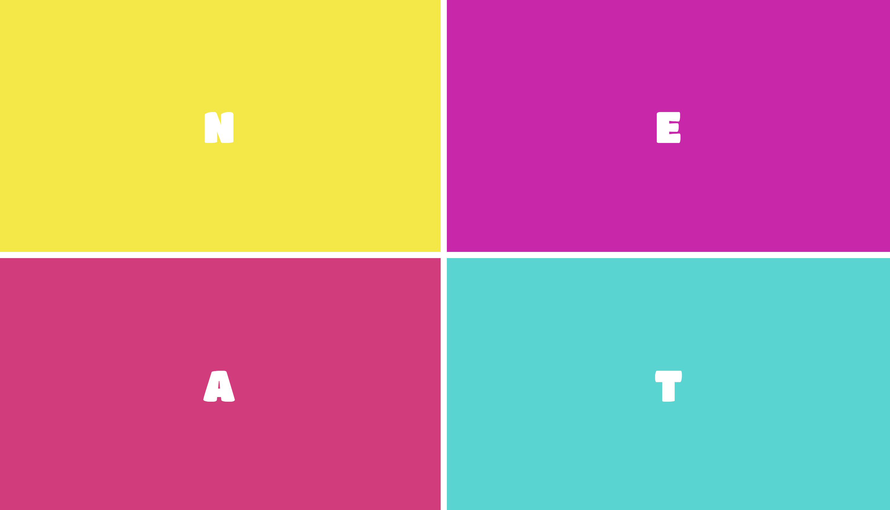

# getting-started-css-grid

Equal pay Equal work is a data visualization project built as a part of SCCA Spring Quarter. Built with my partner, we illuminated the pay disparity between men and women.

Adapted from this tutorial: 
<a href="https://css-tricks.com/getting-started-css-grid/" target="blank">Getting Started with CSS Grid</a>

**Screenshots**

**Live link:**
<a href="https://aheitzen.github.io/getting-started-css-grid/" target="blank">Getting Started: CSS Grid</a>

**Technologies used**
* HTML5
* CSS3 
* CSS Grid 
* Flexbox 

**Unsolved problems** 
* Nada!

